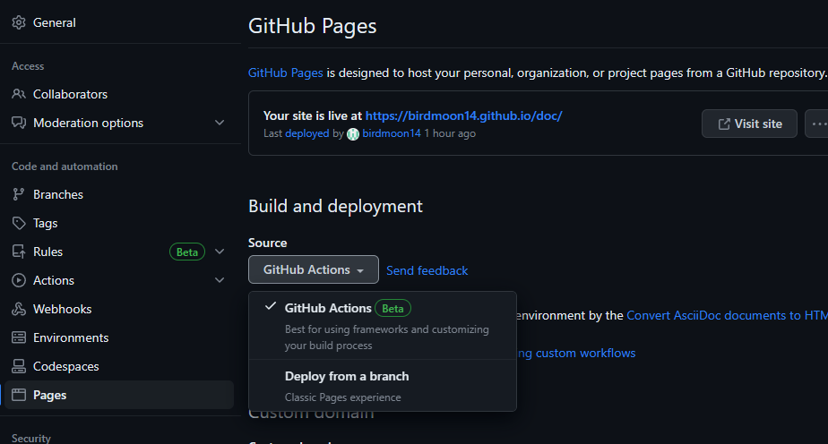

:toc: left
:toclevels: 2
:toc-title: 目次
:sectnums:

:icons: font

== GitHub Pagesの設定
=== リポジトリ作成
==== GitHubにユーザ登録する
WARNING: 自分は既にGitHubアカウントを持っていたため手順は割愛する。

==== GitHubにリポジトリを追加する
image::https://github.com/birdmoon14/doc/blob/main/docs/buildenv/howtolog/images/screenshot-github-01.png?raw=true[]
 RepositoriesのNEWを選択

image::https://github.com/birdmoon14/doc/blob/main/docs/buildenv/howtolog/images/screenshot-github-02.png?raw=true[]
 Repository名は「doc」とした。
 公開するためpublicとした。
 READMEファイルはお好み（つけていることの方が多い）

=== ブランチの作成
WARNING: 通常はブランチを作成して編集するが、今回は個人的なドキュメントであるためmainのみ
※master→mainへの名称変更があったらしい

=== 編集環境（VScode）の構築
image::https://github.com/birdmoon14/doc/blob/main/docs/buildenv/howtolog/images/screenshot-github-03.png?raw=true[]
GitHubからレポジトリのURLをコピーする

ターミナル（コマンドプロンプト）を作業フォルダで開き、以下のコマンドでリポジトリをcloneする
[source,git]
----
git clone https://github.com/birdmoon14/doc.git
----
WARNING: 本手順にはGitの初期設定を含まない。cloneする前にGitのインストールやSSHキーの登録などが必要になる。

VScodeでcloneしたフォルダを開くと、自動的にソース管理の情報が読み込まれる。

=== GitHub PagesへのPushとデプロイ
ここからは
link:https://qiita.com/syuuu/items/061a1b69e95dee9d080d[Qiitaサイト GitHub Pages の GitHub Actions で AsciiDoc の生成を試す]
を参考にした。

==== docsというディレクトリを作成し、その配下にAsciiDocファイルを作成する。
==== GitHubのSettingでPagesの設定を開き、Build and deploymentをGitHub Actionsにする。

==== workflows用のymlファイルを作成する。

.asciidoc-pages.yml
[source,yaml]
----
name: Convert AsciiDoc documents to HTML

on:
  push:
    branches: [ "main" ]

permissions:
  contents: read
  pages: write
  id-token: write

concurrency:
  group: "pages"
  cancel-in-progress: true

jobs:
  # Build job
  build:
    runs-on: ubuntu-latest
    name: convert asciidoc to html
    steps:
    - name: Checkout
      uses: actions/checkout@v3
    - name: Get build container              # ★ 流用
      id: adocbuild                          # ★ 流用
      uses: tonynv/asciidoctor-action@master # ★ 流用
      with:                                  # ★ 流用
          program: "cd docs && make adoc"    # ★ 流用
    - name: Build with Jekyll
      uses: actions/jekyll-build-pages@v1
      with:
        source: ./dist              # ★ ひな型から変更
        destination: ./_site
    - name: Upload artifact
      uses: actions/upload-pages-artifact@v1

  # Deployment job
  deploy:
    environment:
      name: github-pages
      url: ${{ steps.deployment.outputs.page_url }}
    runs-on: ubuntu-latest
    needs: build
    steps:
      - name: Deploy to GitHub Pages
        id: deployment
        uses: actions/deploy-pages@v1

----

==== docs配下にMakefileを作成する

.Makefile
[source]
----
BASE_DIR=..
DOC_ROOT=.

DEST_DIR=$(BASE_DIR)/dist
 SRC_IMAGES_DIR=$(IMAGES_DIR)
 DST_IMAGES_DIR=$(DEST_DIR)/$(IMAGES_DIR)

include $(DOC_ROOT)/asciidoc.mk

HTML_LIST=\
mkdir_and_copy \
$(DEST_DIR)/index.html \
$(DEST_DIR)/buildenv/githubpages.html \

.PHONY: adoc mkdir_and_copy

adoc: $(HTML_LIST)

mkdir_and_copy:
	mkdir -p $(DEST_DIR)
	-test ! -d $(SRC_IMAGES_DIR) || mkdir -p $(DST_IMAGES_DIR)
	-test ! -d $(SRC_IMAGES_DIR) || cp $(CP_OPTS) $(SRC_IMAGES_DIR)/* $(DST_IMAGES_DIR)/

$(DEST_DIR)/%.html: %.adoc header.adoc
	asciidoctor --trace $(AD_OPTS_HTML5_ROUGE) -o "$@" "$<"
----

.asciidoc.mk
[source]
----
IMAGES_DIR=images
CP_OPTS=-n -l
ROUGE_STYLE=monokai_sublime

AD_OPTS_HTML5_COMMON=\
--backend=html5 \
-a imagesdir=$(IMAGES_DIR)

AD_OPTS_HTML5_ROUGE=\
$(AD_OPTS_HTML5_COMMON) \
-r asciidoctor-diagram \
-a source-highlighter=rouge \
-a rouge-style=$(ROUGE_STYLE)

AD_OPTS_HTML5_STEM=\
$(AD_OPTS_HTML5_COMMON)
----

WARNING: Makefile内でheader.adocを呼んでいるため、空のファイルを作成しておくこと。