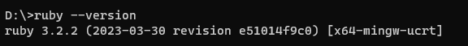

:toc: left
:toclevels: 2
:toc-title: 目次
:sectnums:

:icons: font

== AsciiDoc
=== Rubyの導入
AsciiDocを利用するためにはまずRubyが必要。

==== Rubyをダウンロード

https://rubyinstaller.org/downloads/ - 公式サイト +
今回はRuby+Devkit 3.2.2-1(x64)をダウンロードした。

[caption="Ruby公式サイト",link=https://rubyinstaller.org/downloads/]

==== Rubyをインストール

 「I accept the License」を選択して「Next」

 インストールフォルダを選択。PATHも通してくれる。

WARNING: デフォルトで設定されている値がドライブ名だけ（ex.「D」）になっている場合があるため、インストールフォルダはよく確認（必要な場合は作成）して選択すること。

 すべて選択されているので、問題がなければそのまま次へ

 インストール完了

 ターミナルでもバージョンを確認できた

=== AsciiDocの導入
==== AsciiDoc関連ツールのインストール
ターミナル（コマンドプロンプト）で以下のコマンドを実行し、AsciiDoc関連ツールをインストールする

TIP: 「AsciiDoc」は軽量マークアップ言語を指すものであり、利用にあたってはAsciiDoc形式で記載されたテキストファイルを表示のために変換するツールが必要となる。

[source]
----
gem install asciidoctor // <1>
gem install asciidoctor-diagram // <2>
gem install --pre asciidoctor-pdf // <3>
asciidoctor --version  // <4>
----
<1>  AsciiDocをHTMLに変換する
<2>  AsciiDoc形式のドキュメント内に図式（ex.PlantUML）を埋め込めるようにする
<3>  AsciiDoc形式のドキュメントをPDF化する
<4>  Asciidoctorのバージョン確認をする

TIP: 「--pre」はまだ新しいパッケージに対して一つ前を指定するコマンド。参考にした手順でつけていたためそれに習ったが、現状はつけなくても良かったかもしれない。

